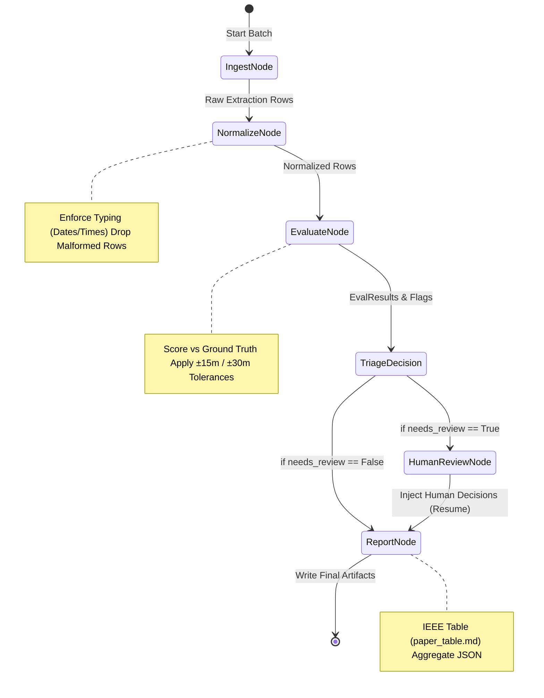
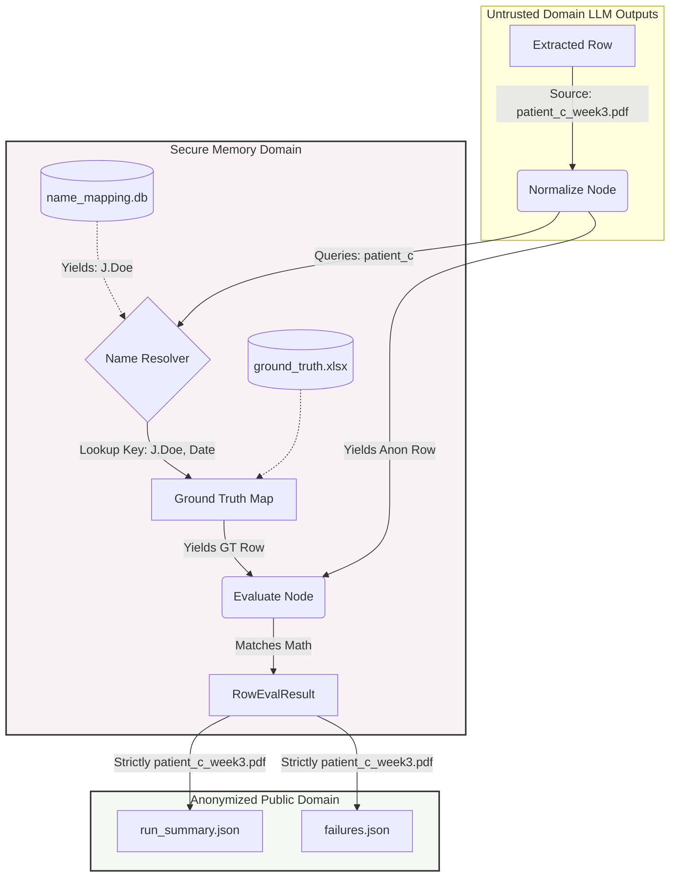

# Homecare Visit Triage Agent — Architecture

This file is the companion architecture note for Chapter 14.
It describes the current evaluation graph, not the original build plan.

## 1. What this system is

The Homecare Visit Triage Agent is a stateful evaluation pipeline built with LangGraph to benchmark document extraction outputs across healthcare timesheets. It does not perform optical character recognition (OCR) or vision-language model (VLM) extraction directly; rather, it ingests pre-extracted timesheet rows produced by upstream extraction methods. The pipeline normalizes raw row entries into typed schema models, evaluates them deterministically against labeled ground truth data, and calculates per-field accuracy and arithmetic consistency. When ambiguous entries or borderline discrepancies arise, the pipeline halts execution at a Human-in-the-Loop (HITL) boundary using an interrupt mechanism to collect reviewer resolutions. Once human decisions are incorporated or if no review is required, the pipeline generates aggregated, anonymized benchmark artifacts. The codebase is organized across dedicated modules: `src/nodes.py` (node functions), `src/graph.py` (graph topology and compilation), `src/evaluation.py` (scoring and row evaluation), `src/name_resolver.py` (ephemeral identity resolution), `src/normalization.py` (type conversion and schema enforcement), and `src/reporting.py` (artifact generation).

## 2. Graph topology

The pipeline is modeled as a compiled `StateGraph` operating over `BenchmarkState` with five sequential and conditional nodes:
- `ingest` (`ingest_node` in `src/nodes.py`): Ingests extracted records from the input spreadsheet into raw `ExtractionRow` structures.
- `normalize` (`normalize_node` in `src/nodes.py`): Validates and converts raw string fields into strongly-typed `NormalizedRow` objects via `src/normalization.py`. Any unparseable or malformed rows are counted in `normalize_skipped` to maintain denominator integrity for downstream scoring.
- `evaluate` (`evaluate_node` in `src/nodes.py`): Evaluates normalized rows against ground truth via `evaluate_file()` in `src/evaluation.py`, computing per-field matches (hours, time-in, time-out) within configured tolerances and identifying rows requiring human inspection.
- `human_review` (`human_review_node` in `src/nodes.py`): Suspends graph execution at the HITL boundary using LangGraph's `interrupt()` call, serializing the flagged rows and waiting for an external resume command containing reviewer decisions.
- `report` (`report_node` in `src/nodes.py`): Aggregates file and method results via `src/reporting.py` and writes anonymized summary artifacts (`run_summary.json`, `paper_table.md`, `failures.json`, and per-method evaluation files).

### Graph Wiring and Triage Rule

Linear edges connect `START -> ingest -> normalize -> evaluate`. After the `evaluate` node completes, a conditional edge invokes `triage_decision`:
- If `needs_review` is `True` and `flagged_for_review` contains flagged rows, the graph routes to `human_review`.
- Otherwise, the graph routes directly to `report`.

Graph compilation in `src/graph.py` configures `interrupt_before=["human_review"]`. When human review is triggered, `report` cannot execute until the graph state is explicitly resumed with human review decisions.

### Review Triggers

Review gating is evaluated during row scoring in `src/evaluation.py`:
- **Hours mismatch within tolerance:** A row where the hours difference is within the acceptable window but exceeds two-thirds of the tolerance limit (borderline hours, e.g., > 10 minutes for a ±15 minute tolerance window).
- **Multiple GT rows for the same (file, date):** Ambiguous grounding where multiple ground truth records match the same file and service date. (In the current codebase, `NameResolver` establishes deterministic 1-to-1 sequential mapping to resolve unique GT keys, while the evaluation engine flags ungrounded coverage gaps).
- **Status is `"flagged"` but values match GT:** A row flagged by the upstream extraction validator whose computed hours nonetheless match ground truth, indicating a disagreement between extractor heuristics and ground truth annotations.

## 3. PHI boundary

Protected Health Information (PHI) isolation is enforced structurally through module boundaries:
- `src/name_resolver.py` is the only module in the entire codebase that handles real patient names and real source filenames. It connects to `name_mapping.db` in-memory.
- In `src/evaluation.py`, `evaluate_file()` invokes `NameResolver.resolve_for_date()` / `NameResolver.resolve()` strictly in-memory to look up ground truth records in the ground truth dictionary. Once the dictionary lookup completes, the real filename is discarded.
- `NormalizedRow.source_file`, `RowEvalResult.source_file`, and `FileEvalResult.source_file` strictly store anonymized identifiers (e.g., `patient_a_week1.pdf`).
- Real patient names and real filenames are never persisted in state, logged, or written to output artifacts (`run_summary.json`, `failures.json`, `paper_table.md`).

## 4. Diagrams used in Chapter 14

### LangGraph state machine

<!-- Printed as Chapter 14 Figure 14.4. Do not edit this mermaid. -->

### Real-filename isolation

<!-- Printed as Chapter 14 Figure 14.5. Do not edit this mermaid. -->

